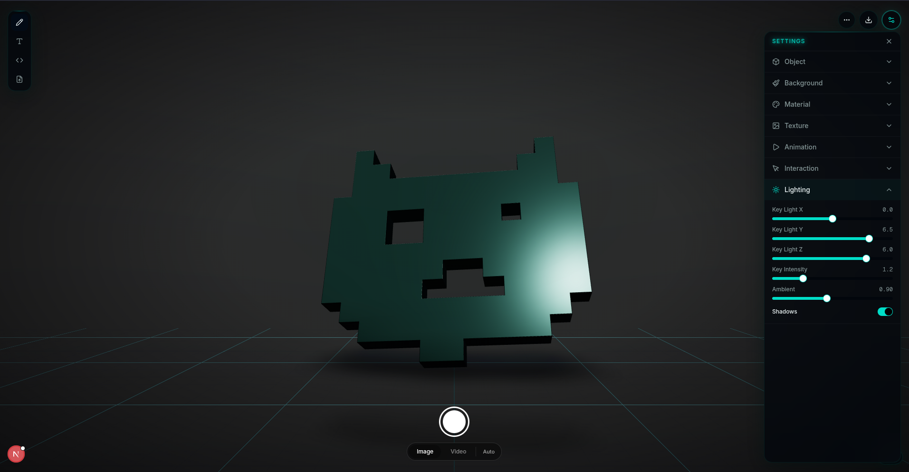

# thicc-svg



The easiest way to turn SVGs into interactive 3D.

[](LICENSE)
[](https://www.npmjs.com/package/thicc-svg)

## Overview

This is a monorepo with two packages:

| Package                               | Description                                                                                                                             |
| ------------------------------------- | --------------------------------------------------------------------------------------------------------------------------------------- |
| [`packages/engine`](packages/engine/) | Embeddable `<SVG3D>` React component — published to npm as [`thicc-svg`](https://www.npmjs.com/package/thicc-svg)                       |
| [`packages/web`](packages/web/)       | Visual editor at [thicc-svg.design](https://thicc-svg.design) — design 3D objects and export as images, video, 3D models, or embed code |

The web editor renders the engine's `<SVG3D>` component directly — what you see in the editor is exactly what you get with the embed.

## Quick Start

```bash
pnpm install
pnpm run build:engine
pnpm run dev:web
```

Open [http://localhost:3000](http://localhost:3000).

## Embed

```bash
pnpm add thicc-svg
```

```tsx
import { SVG3D } from "thicc-svg";

<SVG3D text="Hello" animate="spin" />
<SVG3D svg="/logo.svg" material="gold" />
```

See the full [engine docs](packages/engine/README.md) for all props.

## Web Editor Features

- **4 input methods** — Text (10 Google Fonts), Pixel Editor, SVG Code, File Upload
- **10 material presets** — Default, Plastic, Metal, Glass, Rubber, Chrome, Gold, Clay, Emissive, Holographic
- **7 animations** — Spin, Float, Pulse, Wobble, Swing, Spin+Float, or static
- **Textures** — 10 procedural presets or upload your own
- **Configurable lighting** — Key light position/intensity, ambient, shadows
- **PNG export** — Transparent or with background, up to 4K resolution
- **Video export** — 60fps capture with iOS-style trim UI, MP4 (via FFmpeg WASM) or WebM, quality control
- **3D model export** — Download the scene as GLB (color + materials preserved), STL (3D printing), OBJ, or PLY
- **Camera mode** — iPhone-style shutter button, aspect ratio picker, viewfinder overlay
- **Interactive canvas** — Drag rotation with momentum, scroll zoom, cursor-follow orbit
- **Responsive** — Auto-zooms on narrow/portrait viewports to keep the 3D object visible
- **Embed code export** — Copy-ready `<SVG3D>` JSX snippet with all props from the current editor state
- **Drag & drop** — Drop SVG files anywhere on the page to load them

## Project Structure

```
thicc-svg/
├── packages/
│   ├── engine/                 # npm package "thicc-svg"
│   │   └── src/
│   │       ├── index.tsx       # SVG3D component (public API)
│   │       ├── scene.tsx       # 3D scene, ExtrudedSVG, Canvas
│   │       ├── controls.tsx    # Animations, smooth controls
│   │       ├── materials.ts    # 10 PBR material presets
│   │       ├── types.ts        # SVG3DProps, defaults
│   │       └── use-font.ts     # Google Font loading
│   └── web/                    # Next.js editor app
│       └── src/
│           ├── app/            # Pages
│           ├── components/     # Editor UI, export bar
│           └── lib/            # Textures, FFmpeg, utilities
└── package.json                # npm workspaces root
```

## Tech Stack

| Library                                                     | Purpose                |
| ----------------------------------------------------------- | ---------------------- |
| [Next.js 16](https://nextjs.org/)                           | App framework (web)    |
| [React Three Fiber](https://docs.pmnd.rs/react-three-fiber) | Declarative Three.js   |
| [Three.js](https://threejs.org/)                            | 3D rendering           |
| [tsup](https://tsup.egoist.dev/)                            | Engine bundler         |
| [opentype.js](https://opentype.js.org/)                     | Font to vector paths   |
| [FFmpeg WASM](https://ffmpegwasm.netlify.app/)              | Video conversion (web) |
| [shadcn/ui](https://ui.shadcn.com/)                         | UI components (web)    |
| [Tailwind CSS v4](https://tailwindcss.com/)                 | Styling (web)          |

## License

MIT — [HaithamLeo](https://github.com/HaithamLeo)

Made in [Blueberry](https://meetblueberry.com) 🫐
